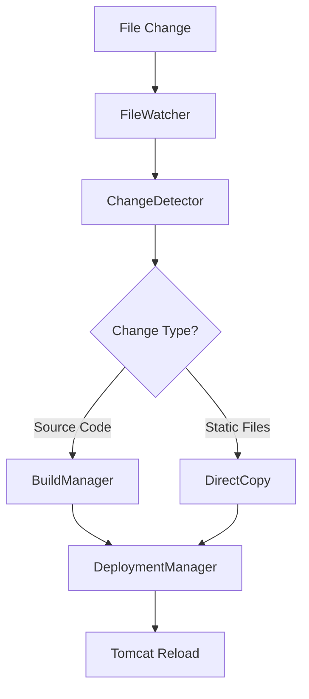

# 🔥 Hot Deploy Implementation

This document explains the technical implementation of TomcatEE's hot deployment system.

## 🎯 Overview

TomcatEE's hot deployment system automatically detects file changes and redeploys applications without manual intervention. It combines file system watching, intelligent build detection, and optimized deployment strategies.

## 🏗️ Architecture

### Core Components

```
Hot Deploy System
├── FileWatcher          # Monitors file system changes
├── BuildManager         # Handles project building
├── DeploymentManager    # Manages application deployment
├── ChangeDetector       # Analyzes change types
└── ConfigurationManager # Manages hot deploy settings
```

### Component Interactions



## 🔍 File Watching System

### FileWatcher Implementation

The FileWatcher uses Node.js `chokidar` library for cross-platform file monitoring:

```typescript
class FileWatcher {
    private watcher: chokidar.FSWatcher;
    private config: HotDeployConfig;
    
    public startWatching(projectPath: string): void {
        this.watcher = chokidar.watch(projectPath, {
            ignored: this.getIgnorePatterns(),
            persistent: true,
            ignoreInitial: true,
            followSymlinks: false,
            depth: 10
        });
        
        this.watcher
            .on('change', this.handleFileChange.bind(this))
            .on('add', this.handleFileAdd.bind(this))
            .on('unlink', this.handleFileDelete.bind(this));
    }
    
    private getIgnorePatterns(): string[] {
        return [
            '**/target/**',
            '**/build/**',
            '**/node_modules/**',
            '**/.git/**',
            '**/.idea/**',
            '**/.vscode/**',
            ...this.config.excludeDirectories
        ];
    }
}
```

### Watched File Types

Default watched extensions:
- **Java Sources**: `.java`
- **Web Resources**: `.jsp`, `.html`, `.css`, `.js`
- **Configuration**: `.xml`, `.properties`, `.yaml`, `.yml`
- **Templates**: `.ftl`, `.vm`, `.mustache`

### Change Detection Strategy

```typescript
interface FileChange {
    path: string;
    type: 'add' | 'change' | 'unlink';
    timestamp: number;
    category: 'source' | 'resource' | 'config';
}

class ChangeDetector {
    public categorizeChange(filePath: string): ChangeCategory {
        const extension = path.extname(filePath);
        
        if (this.isSourceFile(extension)) {
            return 'source';
        } else if (this.isResourceFile(extension)) {
            return 'resource';
        } else if (this.isConfigFile(extension)) {
            return 'config';
        }
        
        return 'unknown';
    }
    
    private isSourceFile(ext: string): boolean {
        return ['.java', '.kt', '.scala'].includes(ext);
    }
    
    private isResourceFile(ext: string): boolean {
        return ['.jsp', '.html', '.css', '.js', '.png', '.jpg'].includes(ext);
    }
}
```

## 🔨 Build Management

### Build Strategy Selection

TomcatEE automatically detects the build system and applies appropriate strategies:

```typescript
class BuildManager {
    public async detectBuildSystem(projectPath: string): Promise<BuildSystem> {
        if (await this.fileExists(path.join(projectPath, 'pom.xml'))) {
            return new MavenBuildSystem();
        } else if (await this.fileExists(path.join(projectPath, 'build.gradle'))) {
            return new GradleBuildSystem();
        } else {
            return new GenericBuildSystem();
        }
    }
}
```

### Maven Build Strategy

```typescript
class MavenBuildSystem implements BuildSystem {
    public async build(projectPath: string, changes: FileChange[]): Promise<BuildResult> {
        const hasSourceChanges = changes.some(c => c.category === 'source');
        
        if (hasSourceChanges) {
            return this.fullBuild(projectPath);
        } else {
            return this.resourceOnlyBuild(projectPath, changes);
        }
    }
    
    private async fullBuild(projectPath: string): Promise<BuildResult> {
        const command = 'mvn compile war:war -DskipTests';
        return this.executeCommand(command, projectPath);
    }
    
    private async resourceOnlyBuild(projectPath: string, changes: FileChange[]): Promise<BuildResult> {
        // Copy resources directly without full compilation
        for (const change of changes) {
            await this.copyResource(change.path, projectPath);
        }
        return { success: true, duration: 100 };
    }
}
```

### Incremental Build Optimization

```typescript
class IncrementalBuildManager {
    private lastBuildTime: Map<string, number> = new Map();
    
    public needsRebuild(projectPath: string, changes: FileChange[]): boolean {
        const lastBuild = this.lastBuildTime.get(projectPath) || 0;
        const hasRecentChanges = changes.some(c => c.timestamp > lastBuild);
        
        if (!hasRecentChanges) {
            return false;
        }
        
        // Check if WAR file is newer than source changes
        const warPath = this.getWarPath(projectPath);
        const warTime = this.getFileModTime(warPath);
        const latestChange = Math.max(...changes.map(c => c.timestamp));
        
        return latestChange > warTime;
    }
}
```

## 🚀 Deployment Strategies

### Deployment Manager

```typescript
class DeploymentManager {
    public async deploy(instance: TomcatInstance, warPath: string): Promise<void> {
        const strategy = this.selectDeploymentStrategy(instance);
        await strategy.deploy(warPath, instance);
    }
    
    private selectDeploymentStrategy(instance: TomcatInstance): DeploymentStrategy {
        if (instance.isRunning()) {
            return new HotDeploymentStrategy();
        } else {
            return new ColdDeploymentStrategy();
        }
    }
}
```

### Hot Deployment Strategy

```typescript
class HotDeploymentStrategy implements DeploymentStrategy {
    public async deploy(warPath: string, instance: TomcatInstance): Promise<void> {
        const webappsDir = path.join(instance.getInstancePath(), 'webapps');
        const contextPath = this.getContextPath(warPath);
        
        // 1. Undeploy existing application
        await this.undeploy(webappsDir, contextPath);
        
        // 2. Copy new WAR file
        await this.copyWar(warPath, webappsDir);
        
        // 3. Wait for Tomcat to auto-deploy
        await this.waitForDeployment(instance, contextPath);
    }
    
    private async waitForDeployment(instance: TomcatInstance, contextPath: string): Promise<void> {
        const maxWait = 30000; // 30 seconds
        const startTime = Date.now();
        
        while (Date.now() - startTime < maxWait) {
            if (await this.isApplicationDeployed(instance, contextPath)) {
                return;
            }
            await this.sleep(1000);
        }
        
        throw new Error('Deployment timeout');
    }
}
```

### Resource-Only Deployment

For static resource changes, TomcatEE can update files without full redeployment:

```typescript
class ResourceDeploymentStrategy {
    public async deployResources(changes: FileChange[], instance: TomcatInstance): Promise<void> {
        const webappPath = this.getDeployedWebappPath(instance);
        
        for (const change of changes) {
            const targetPath = this.mapToWebappPath(change.path, webappPath);
            
            switch (change.type) {
                case 'change':
                case 'add':
                    await fs.copyFile(change.path, targetPath);
                    break;
                case 'unlink':
                    await fs.unlink(targetPath);
                    break;
            }
        }
    }
}
```

## ⚡ Performance Optimizations

### Debouncing

Prevent excessive rebuilds during rapid file changes:

```typescript
class ChangeDebouncer {
    private pendingChanges: Map<string, FileChange[]> = new Map();
    private timers: Map<string, NodeJS.Timeout> = new Map();
    
    public addChange(projectPath: string, change: FileChange): void {
        // Add to pending changes
        const changes = this.pendingChanges.get(projectPath) || [];
        changes.push(change);
        this.pendingChanges.set(projectPath, changes);
        
        // Reset timer
        const existingTimer = this.timers.get(projectPath);
        if (existingTimer) {
            clearTimeout(existingTimer);
        }
        
        const timer = setTimeout(() => {
            this.processChanges(projectPath);
        }, this.debounceDelay);
        
        this.timers.set(projectPath, timer);
    }
}
```

### Parallel Processing

Process multiple projects concurrently:

```typescript
class ParallelDeploymentManager {
    private readonly maxConcurrency = 3;
    private activeDeployments = 0;
    private deploymentQueue: DeploymentTask[] = [];
    
    public async queueDeployment(task: DeploymentTask): Promise<void> {
        return new Promise((resolve, reject) => {
            task.resolve = resolve;
            task.reject = reject;
            
            this.deploymentQueue.push(task);
            this.processQueue();
        });
    }
    
    private async processQueue(): Promise<void> {
        if (this.activeDeployments >= this.maxConcurrency || this.deploymentQueue.length === 0) {
            return;
        }
        
        const task = this.deploymentQueue.shift()!;
        this.activeDeployments++;
        
        try {
            await this.executeDeployment(task);
            task.resolve();
        } catch (error) {
            task.reject(error);
        } finally {
            this.activeDeployments--;
            this.processQueue();
        }
    }
}
```

### Caching

Cache build results and deployment artifacts:

```typescript
class BuildCache {
    private cache: Map<string, CacheEntry> = new Map();
    
    public getCachedBuild(projectPath: string, sourceHash: string): BuildResult | null {
        const entry = this.cache.get(projectPath);
        
        if (entry && entry.sourceHash === sourceHash) {
            return entry.buildResult;
        }
        
        return null;
    }
    
    public cacheBuild(projectPath: string, sourceHash: string, result: BuildResult): void {
        this.cache.set(projectPath, {
            sourceHash,
            buildResult: result,
            timestamp: Date.now()
        });
    }
}
```

## 🔧 Configuration

### Hot Deploy Configuration

```typescript
interface HotDeployConfig {
    enabled: boolean;
    watchExtensions: string[];
    excludeDirectories: string[];
    deployDelay: number;
    buildTimeout: number;
    maxRetries: number;
    debounceDelay: number;
    parallelBuilds: boolean;
    incrementalBuild: boolean;
}
```

### Default Configuration

```json
{
    "enabled": true,
    "watchExtensions": ["java", "jsp", "html", "css", "js", "xml", "properties"],
    "excludeDirectories": ["target", "build", "node_modules", ".git", ".idea", ".vscode"],
    "deployDelay": 1000,
    "buildTimeout": 300000,
    "maxRetries": 3,
    "debounceDelay": 2000,
    "parallelBuilds": true,
    "incrementalBuild": true
}
```

## 📊 Monitoring and Logging

### Performance Metrics

```typescript
class HotDeployMetrics {
    public recordDeployment(duration: number, success: boolean): void {
        this.deploymentTimes.push(duration);
        this.successRate.record(success);
    }
    
    public getAverageDeploymentTime(): number {
        return this.deploymentTimes.reduce((a, b) => a + b, 0) / this.deploymentTimes.length;
    }
    
    public getSuccessRate(): number {
        return this.successRate.getRate();
    }
}
```

### Debug Logging

```typescript
class HotDeployLogger {
    public logFileChange(change: FileChange): void {
        console.log(`[HotDeploy] File ${change.type}: ${change.path}`);
    }
    
    public logBuildStart(projectPath: string): void {
        console.log(`[HotDeploy] Starting build for ${projectPath}`);
    }
    
    public logDeploymentComplete(duration: number): void {
        console.log(`[HotDeploy] Deployment completed in ${duration}ms`);
    }
}
```

## 🔗 Integration Points

### VSCode Integration

```typescript
class VSCodeIntegration {
    public showDeploymentProgress(projectName: string): void {
        vscode.window.withProgress({
            location: vscode.ProgressLocation.Notification,
            title: `Deploying ${projectName}...`,
            cancellable: false
        }, async (progress) => {
            // Progress updates during deployment
        });
    }
    
    public showDeploymentResult(success: boolean, duration: number): void {
        const message = success 
            ? `Deployment completed in ${duration}ms`
            : 'Deployment failed';
            
        vscode.window.showInformationMessage(message);
    }
}
```

### Tomcat Integration

```typescript
class TomcatIntegration {
    public async reloadContext(instance: TomcatInstance, contextPath: string): Promise<void> {
        const managerUrl = `http://localhost:${instance.getHttpPort()}/manager/text/reload?path=${contextPath}`;
        
        try {
            await this.httpClient.get(managerUrl, {
                auth: instance.getManagerCredentials()
            });
        } catch (error) {
            throw new Error(`Failed to reload context: ${error.message}`);
        }
    }
}
```

## 🎯 Future Enhancements

### Planned Features

1. **Smart Change Detection**: AI-powered change impact analysis
2. **Micro-deployments**: Deploy only changed classes/resources
3. **Rollback Support**: Automatic rollback on deployment failures
4. **Multi-instance Sync**: Synchronize deployments across multiple instances
5. **Performance Profiling**: Built-in deployment performance analysis

### Extensibility

The hot deploy system is designed to be extensible:

```typescript
interface HotDeployPlugin {
    name: string;
    version: string;
    
    onFileChange(change: FileChange): Promise<void>;
    onBuildStart(projectPath: string): Promise<void>;
    onBuildComplete(result: BuildResult): Promise<void>;
    onDeploymentComplete(success: boolean): Promise<void>;
}
```

---

**This implementation provides fast, reliable hot deployment for efficient development workflows.**
